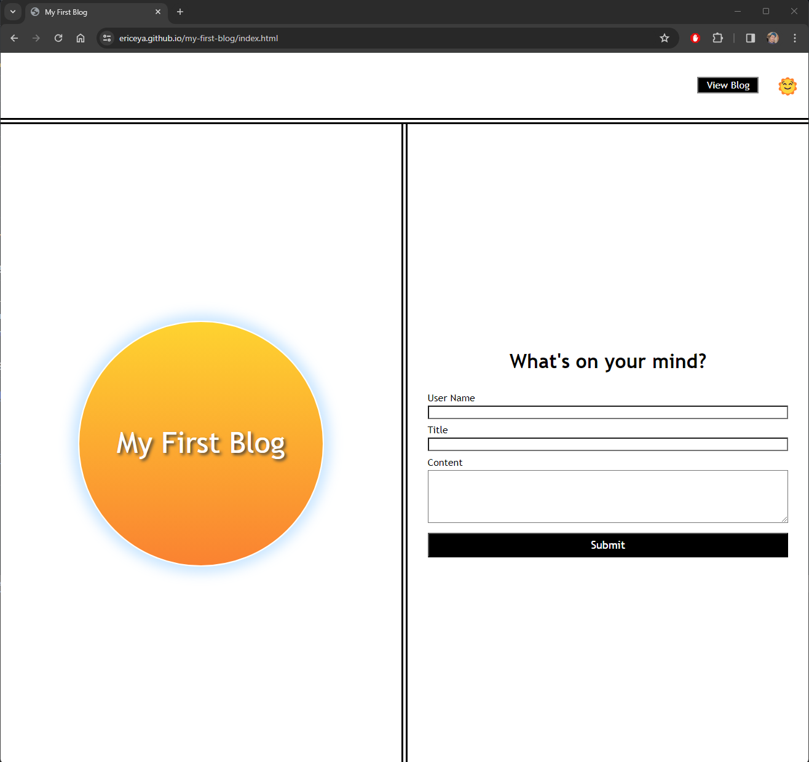
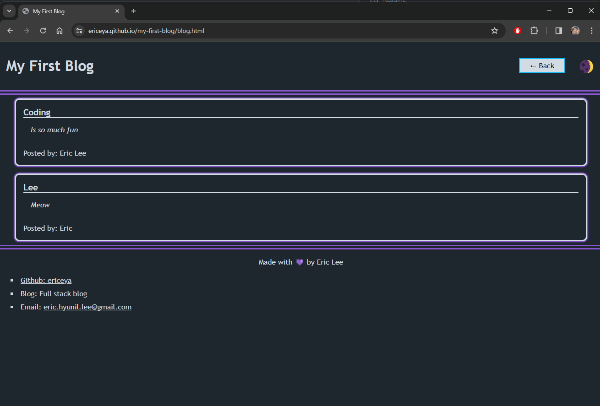

# My First Blog

The blog was created using HTML / CSS / Javascript files.

## Features

- Dark/Light theme modes are selectable by clicking on the sun/moon emoji at the top right corner.
- The form data is saved in localStorage for it to be reloaded to the screen when the page is loaded.
- User input validation in place to prevent empty strings to be entered.

## Screenshots

## Link to Deploy

[Click here for deployed page](https://ericeya.github.io/my-first-blog)